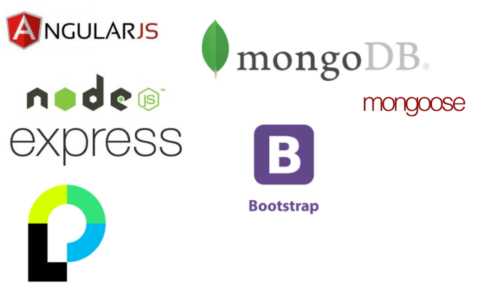

# CoffeePodcast

> Single-page application to stay up-to-date with your favorite podcasts

## Team

  - __Product Owner__: Lili

## Table of Contents

1. [Usage](#Usage)
1. [Requirements](#requirements)
1. [Development](#development)
    1. [Installing Dependencies](#installing-dependencies)
    1. [Tasks](#tasks)
1. [Team](#team)
1. [Contributing](#contributing)

## Usage

> -on starting the app: 
>-npm run start

## Requirements

- Node 
- Angular 
- MongoDB

## Development

### Installing Dependencies

From within the root directory:

```
npm install
```

## Tech Stack



